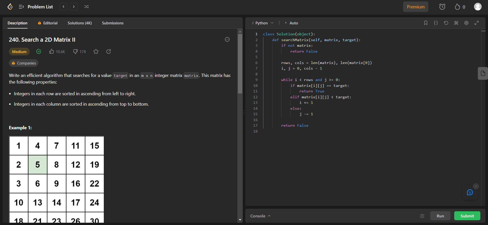
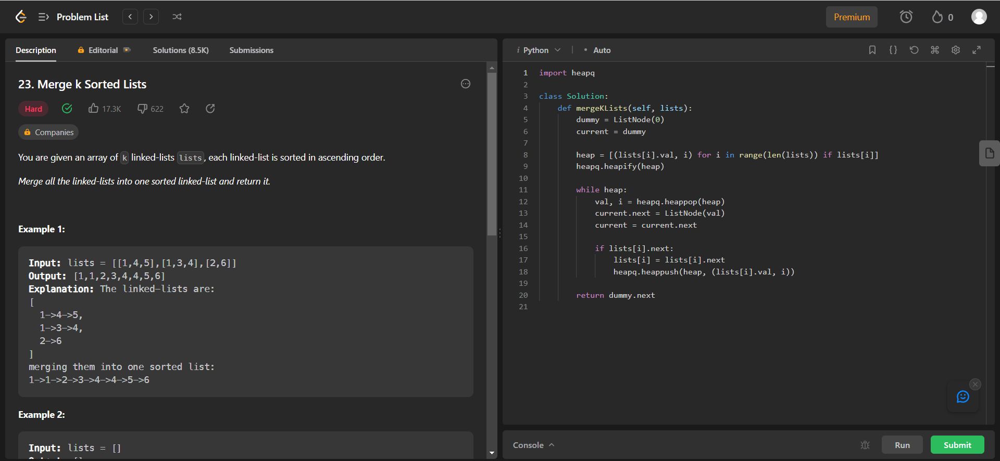
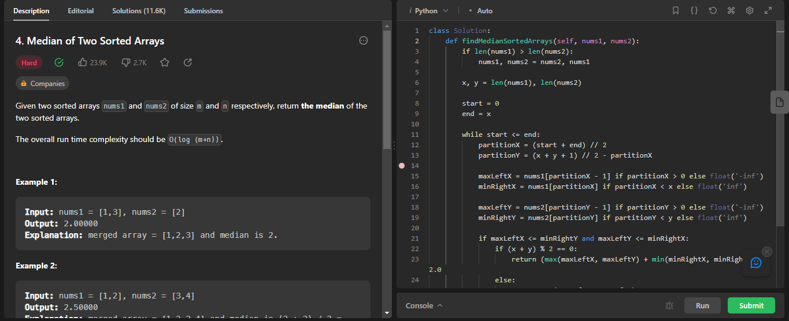

# NomedoProjeto

**Número da Lista**: 42<br>
**Conteúdo da Disciplina**: Dividir e Conquistar<br>

## Alunos
|Matrícula | Aluno |
| -- | -- |
| 19/0118555  |  Wengel Rodrigues Farias |

## Video da Apresentação

[Link do Vídeo]()


## Sobre 
Este projeto foi feito com a resolução de 3 exercícios abordando o tema de Dividir e Conquistar. Os exercícios foram retirados do site: [LeetCode](https://leetcode.com/).

## Screenshots

### Exercicio 1 - Search a 2D Matrix II

Link: [Search a 2D Matrix II](https://leetcode.com/problems/search-a-2d-matrix-ii/) <br>
Dificuldade: Médio



### Exercicio 2 - Merge k Sorted Lists

Link: [Merge k Sorted Lists](https://leetcode.com/problems/merge-k-sorted-lists/) <br>
Dificuldade: Difícil



### Exercicio 3 - Median of Two Sorted Arrays

Link: [Median of Two Sorted Arrays](https://leetcode.com/problems/median-of-two-sorted-arrays/) <br>
Dificuldade: Difícil




## Instalação 
**Linguagem**: Python<br>

Caso queira testar localmente é necessário instalar python:

- ### Windows
Baixe o pacote Python do [site official](https://www.python.org/downloads/), e no momento da instação, marque a opção "Add Python to PATH".

- ### Linux
Execute no terminal do linux a atualização dos pacotes e instalação do python3

```bash
sudo apt-get update
sudo apt-get install python3
```


## Uso 
Para verificar o funcionamento basta abrir o link do exercicio e copiar o código referente a questão, e logo após realizar o envio. Caso queira verificar localmente, é necessário executar o programa, e para isto basta utilizar o comando:

`python NomeDoArquivo.py`.


